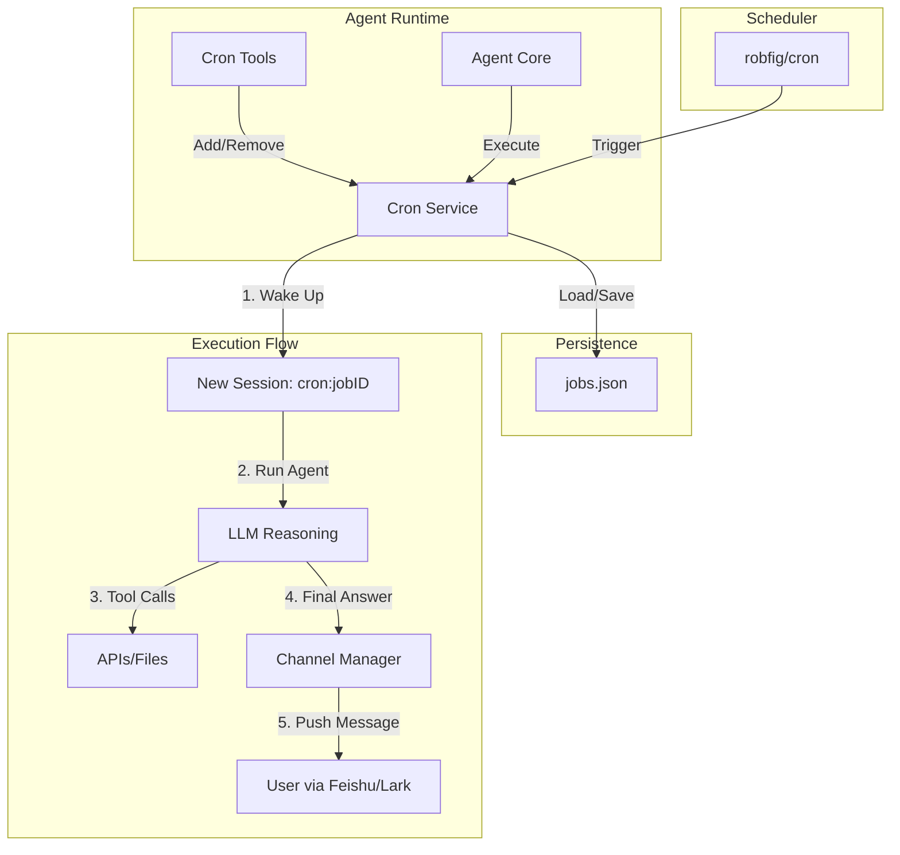

# GoPaw Cron System Design

**Author:** GoPaw Team  
**Date:** 2026-03-05  
**Status:** In Progress  

## 1. Overview

The **GoPaw Cron System** empowers the AI Agent to schedule recurring tasks autonomously. It transforms the agent from a reactive responder into a proactive assistant capable of managing schedules, monitoring data, and performing routine maintenance.

### Key Goals
- **Autonomy**: Agents can add/remove/list jobs via tools (`cron_add`, `cron_list`, `cron_remove`).
- **Persistence**: Jobs survive restarts (saved to `workspace/cron/jobs.json`).
- **Isolation**: Each job execution runs in a dedicated session context to avoid polluting user chat history.
- **Reliability**: Atomic file writes, error handling, and delivery guarantees.

---

## 2. Architecture

The system follows a layered architecture inspired by **PicoClaw** (simplicity & persistence) and **OpenClaw** (execution model).



### Reference Analysis

| Project | Feature Adopted | Why? |
| :--- | :--- | :--- |
| **PicoClaw** | **JSON Persistence** | Simple, portable, and easy to debug. Atomic write pattern prevents data corruption. |
| **OpenClaw** | **Isolated Session** | Keeping cron tasks out of the main chat history prevents context pollution and hallucination. |
| **ZeroClaw** | **Agent-Centric Job** | The job payload is a natural language instruction ("Check weather"), not just a script. |
| **CoPaw** | **APScheduler** | (Concept only) We use Go's `robfig/cron` which is the equivalent standard in Go ecosystem. |

---

## 3. Data Models

### 3.1 CronJob Structure
Stored in `workspace/cron/jobs.json`.

```go
type CronJob struct {
    ID          string     `json:"id"`           // UUID
    Name        string     `json:"name"`         // Human-readable label
    Schedule    string     `json:"schedule"`     // Cron spec: "0 0 9 * * *" (Supports seconds)
    Task        string     `json:"task"`         // Instruction: "Summarize Hacker News"
    Channel     string     `json:"channel"`      // Target channel: "feishu"
    TargetID    string     `json:"target_id"`    // Target ChatID
    Enabled     bool       `json:"enabled"`      // Pause/Resume toggle
    CreatedAt   time.Time  `json:"created_at"`
    LastRunAt   *time.Time `json:"last_run_at,omitempty"`
    LastResult  string     `json:"last_result,omitempty"` // "success" or error message
}
```

---

## 4. Component Design

### 4.1 CronService (`internal/cron`)
The central coordinator.

*   **Dependencies**: `robfig/cron/v3`, `Agent`, `ChannelManager`.
*   **Key Methods**:
    *   `Start()` / `Stop()`: Lifecycle management.
    *   `AddJob(name, schedule, task, channel, targetID)`: Registers and persists a job.
    *   `RemoveJob(id)`: Stops and deletes a job.
    *   `ListJobs()`: Returns all jobs.
    *   `runJob(job *CronJob)`: The internal trigger handler.

### 4.2 Execution Logic (`runJob`)
1.  **Context Creation**: Create a context with timeout (e.g., 5 mins).
2.  **Session Init**: `sessionID := "cron:" + job.ID`.
3.  **Agent Invocation**: Call `agent.Process(ctx, request)`.
    *   `request.Content` = `job.Task`
    *   `request.SessionID` = `sessionID`
4.  **Result Capture**:
    *   The Agent's **Final Answer** is captured.
    *   If the Agent explicitly calls `send_to_user`, that also works.
    *   If the Agent returns a final text, `CronService` invokes `ChannelManager.Send()` to deliver it to `job.TargetID`.

---

## 5. Tool Interfaces (`internal/tool/builtin`)

These tools are exposed to the LLM.

### `cron_add`
*   **Desc**: "Schedule a recurring task. Schedule format is standard cron (Seconds Minutes Hours Day Month Week)."
*   **Params**: `name`, `schedule`, `task`.
*   **Behavior**: Infers `channel` and `target_id` from the current conversation context.

### `cron_list`
*   **Desc**: "List all active scheduled jobs."
*   **Params**: None.

### `cron_remove`
*   **Desc**: "Cancel a scheduled job by ID."
*   **Params**: `job_id`.

---

## 6. Implementation Plan

- [ ] **Phase 1: Foundation**
    - Create `internal/cron` package.
    - Implement `CronJob` struct and JSON persistence (Load/Save).
    - Integrate `robfig/cron`.

- [ ] **Phase 2: Execution Engine**
    - Implement `runJob` loop.
    - Connect `Agent` interface for task execution.
    - Connect `ChannelManager` for output delivery.

- [ ] **Phase 3: Tools**
    - Implement `cron_add`, `cron_list`, `cron_remove` in `internal/tool/builtin`.
    - Register tools in `registry`.

- [ ] **Phase 4: Integration**
    - Wire everything up in `cmd/gopaw/main.go`.
    - Test with a simple task: "Every 10 seconds say hello".
