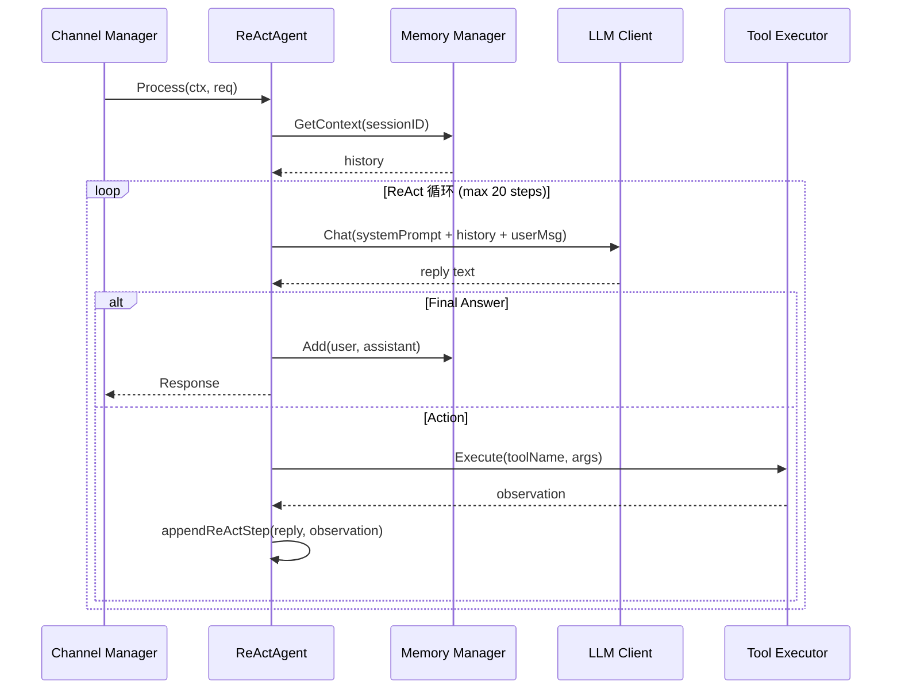

# Agent 模块设计文档

## 职责

Agent 模块实现 GoPaw 的核心推理引擎，基于 ReAct（Reasoning + Acting）范式：
- 接收用户请求，从 Memory 加载历史上下文
- 动态构建系统提示（基础提示 + Skills 片段 + Tools 描述）
- 驱动 LLM 进行 Thought→Action→Observation 循环，直到输出 Final Answer
- 解析 LLM 输出，调用对应 Tool，将 Observation 追加回消息列表
- 完成后将对话写入 Memory

Agent 模块**不负责**：
- 频道消息的接收和发送（Channel Manager 负责）
- HTTP 路由（Server 负责）

## 架构图



## 核心接口

```go
type ReActAgent struct { ... }

func New(llmClient, toolRegistry, skillManager, memoryManager, cfg, logger) *ReActAgent
func (a *ReActAgent) Process(ctx context.Context, req *types.Request) (*types.Response, error)
func (a *ReActAgent) Sessions() *SessionManager

// 内部：
func parseReActOutput(text string) parsedReAct
func buildSystemPrompt(base, skills string, tools []plugin.Tool) string
func buildMessages(systemPrompt string, history []memory.MemoryMessage, content string) []llm.ChatMessage
func appendReActStep(msgs []llm.ChatMessage, reply, observation string) []llm.ChatMessage
```

## 关键设计决策

1. **文本解析 vs. Function Calling**：ReAct 使用正则解析 `Action:` / `Final Answer:` 模式，兼容所有 LLM（包括不支持 function calling 的模型）。Function calling 工具定义也构建但作为备选。
2. **maxSteps 保护**：默认 20 步防止 LLM 陷入无限循环。超过限制返回错误，让 Channel 层告知用户。
3. **内存压缩触发**：在 Process 开始时检查 token 估算，超过阈值立即压缩，不等到后续调用。
4. **空 sessionID 处理**：传入空 sessionID 时使用 "default"，适合 CLI 场景。

## 依赖关系

- **依赖**：`internal/llm`、`internal/memory`、`internal/skill`、`internal/tool`、`pkg/types`
- **被依赖**：`internal/server/handlers`（HTTP API）、`cmd/gopaw`（消息循环）

## 验收标准

- [ ] 单轮不需要工具的对话能正确返回 Final Answer
- [ ] 需要工具的对话能解析 Action/ActionInput 并调用 Tool，再继续循环
- [ ] 超过 maxSteps 时返回明确错误，不无限阻塞
- [ ] 完成后对话被写入 Memory，下次请求能看到历史
- [ ] context 取消（用户断开）时循环能正确停止

## 配置项

```yaml
agent:
  system_prompt: |
    你是一个智能助理...
  max_steps: 20
```
