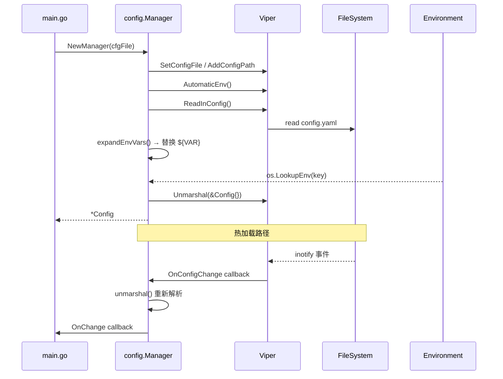

# Config 模块设计文档

## 职责

Config 模块负责：
- 从 YAML 文件加载配置并映射到强类型结构体
- 支持 `${ENV_VAR}` 语法的环境变量替换（用于敏感信息隔离）
- 提供配置热加载（基于 fsnotify），修改 config.yaml 后无需重启即可生效
- 在其他模块之间作为只读配置快照的单一来源

Config 模块**不负责**：
- 持久化用户自定义配置（由各插件自己管理）
- 运行时动态写回 config.yaml

## 架构图



## 核心接口

```go
// Manager 是配置系统的入口
type Manager struct { ... }

func NewManager(cfgFile string, logger *zap.Logger) (*Manager, error)
func (m *Manager) Get() *Config          // 返回当前配置快照
func (m *Manager) OnChange(fn func(*Config))  // 注册热加载回调
func (m *Manager) WatchConfig()          // 启动文件监听

// Watcher 封装热加载生命周期
type Watcher struct { ... }
func NewWatcher(m *Manager, logger *zap.Logger) *Watcher
func (w *Watcher) Start()
```

## 关键设计决策

1. **单向数据流**：Config 对象对外只读（通过 `Get()` 返回指针，调用方约定不修改）。
2. **环境变量优先**：`${VAR}` 替换在 Viper Unmarshal 之前完成，确保所有字符串字段都能携带环境变量值。
3. **安全默认值**：`setDefaults()` 确保未填写的字段有合理默认值，程序不会因配置缺失而崩溃。
4. **热加载仅限安全项**：Watcher 只刷新内存中的 `*Config`；端口、插件启用列表等需要重启才能生效的项在文档中明确说明。

## 依赖关系

- **依赖**：`github.com/spf13/viper`、`github.com/fsnotify/fsnotify`、`go.uber.org/zap`
- **被依赖**：几乎所有其他内部模块都通过 `config.Manager.Get()` 读取配置

## 验收标准

- [ ] 启动时能正确解析 `config.yaml.example` 中的所有字段
- [ ] `${OPENAI_API_KEY}` 等占位符在运行时被对应环境变量替换
- [ ] 修改 `agent.system_prompt` 后约 1 秒内 `Get()` 返回新值
- [ ] 配置文件缺失时返回包含上下文的错误，不 panic
- [ ] 所有配置字段都有合理的默认值（通过 `setDefaults` 覆盖）

## 配置项

见 `config.yaml.example`，包含全部字段及注释。
