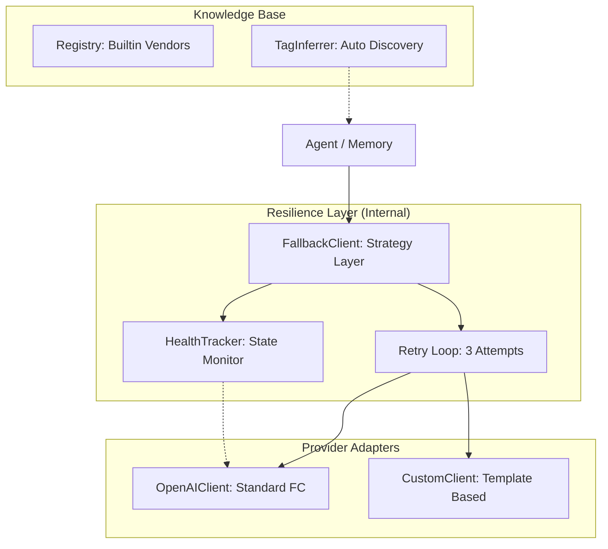

# LLM 模块设计文档

## 职责

LLM 模块是 GoPaw 的核心能力适配层，负责屏蔽不同大模型提供商的接口差异，并提供稳定、可靠的调用环境。它采用“策略-健康-适配”三层架构，确保 Agent 运行的韧性。

### 核心特性

1.  **统一接口 (Client Interface)**：定义标准的 `Chat` 和 `Stream` 方法，支持 Function Calling、流式输出和视觉理解。
2.  **能力画像 (Capability Tags)**：为每个模型建立画像（`fc`, `vision`, `reasoning`），支持自动推断与手动覆盖，指导 Agent 决策。
3.  **健康追踪 (Health Management)**：全局单例 `HealthTracker` 实时监控所有 Provider。
    *   **状态模型**：`Healthy` (正常), `Cooldown` (冷却), `Degraded` (失效)。
    *   **故障隔离**：支持 429 限流指数退避与持久授权错误（401）的物理隔离。
4.  **弹性重试与回退 (Fallback & Retry)**：
    *   内置 3 次指数退避重试。
    *   `FallbackClient` 自动跳过冷却中的节点，尝试优先级链中的下一个可用模型。
5.  **厂商注册表 (Builtin Registry)**：预置主流厂商（OpenAI, Anthropic, 阿里云, DeepSeek, Google）的配置模板，简化用户配置负担。

---

## 架构图



---

## 核心算法

### 1. 冷却算法 (Exponential Backoff)
当模型报错或限流时，`HealthTracker` 会计算下一次可尝试的时间点：
*   **公式**：`wait = 60s * 2^(failures-1)`
*   **范围**：1 分钟起步，最高冷却 1 小时。
*   **重置**：任何一次成功请求都会立即清除该 Provider 的失败计数和冷却时间。

### 2. 标签推断 (Tag Inference)
根据模型标识符自动赋予能力：
*   `gpt-4*`, `claude-3*`, `qwen-*` → **fc** (Function Calling)
*   `*-vision`, `gpt-4o`, `gemini-1.5` → **vision**
*   `r1`, `o1-*`, `reasoner` → **reasoning** (Thinking Process)

---

## 关键代码映射

| 功能 | 对应文件 | 核心逻辑 |
| :--- | :--- | :--- |
| 接口定义 | `client.go` | `Client` interface, `ChatRequest/Response` |
| 健康监控 | `health.go` | `HealthTracker`, `RecordFailure()`, `IsAvailable()` |
| 容错分发 | `fallback.go` | `FallbackClient`, `Chat()`, `GetChainFunc` |
| 标准适配 | `openai.go` | `OpenAIClient`, SSE Stream Parser, Tool Mapping |
| 预置厂商 | `registry.go` | `BuiltinProviders`, `InferTags()` |

---

## 治理策略

1.  **错误分类**：区分临时错误（重试+冷却）与持久错误（直接降级为 Degraded）。
2.  **零感知回退**：`FallbackClient` 在执行时如果主模型不可用，会默默尝试备用模型，只有当整个候选链都失效时才向 Agent 抛出错误。
3.  **影子变量保护**：在日志中严禁打印完整的 API Key，仅保留前 8 位用于审计。

---

## 配置项 (数据库 providers 表)

```json
{
  "id": "uuid",
  "name": "阿里云百炼-QwenMax",
  "base_url": "https://dashscope.aliyuncs.com/compatible-mode/v1",
  "model": "qwen-max",
  "tags": ["fc", "vision"],
  "is_active": true
}
```
