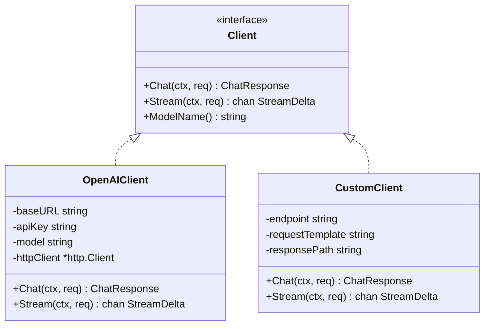

# LLM 模块设计文档

## 职责

LLM 模块提供统一的语言模型调用接口，屏蔽不同提供商之间的 API 差异。具体负责：
- 定义 `Client` 接口，供 Agent 和 Memory 模块调用
- 实现 OpenAI Chat Completions 兼容端点（支持普通调用、流式调用、工具调用）
- 实现自定义适配器，通过模板+路径映射支持任意 LLM API
- 内置重试机制（指数退避，最多 3 次）

LLM 模块**不负责**：
- Token 计数（由 Memory 模块用 tiktoken-go 完成）
- 上下文窗口管理
- Prompt 构建

## 架构图



## 核心接口

```go
type Client interface {
    Chat(ctx context.Context, req ChatRequest) (*ChatResponse, error)
    Stream(ctx context.Context, req ChatRequest) (<-chan StreamDelta, error)
    ModelName() string
}
```

## 关键设计决策

1. **接口抽象**：Agent 只依赖 `Client` 接口，切换模型提供商无需修改 Agent 代码。
2. **流式 SSE 解析**：Stream 方法在独立 goroutine 中解析 Server-Sent Events，通过 channel 返回给调用方，调用方可随时通过 context 取消。
3. **重试策略**：仅在 Chat（非流式）中实现重试（网络瞬断场景），流式请求不重试（已部分输出）。
4. **自定义适配器**：CustomClient 通过 `{{messages}}` 模板占位符和 dot-path 响应提取，无需修改代码即可对接非 OpenAI 格式的 API。

## 依赖关系

- **依赖**：标准库 `net/http`、`encoding/json`、`go.uber.org/zap`
- **被依赖**：`internal/agent`（主调用方）、`internal/memory`（压缩调用）

## 验收标准

- [ ] 能正确调用 OpenAI /chat/completions 并返回 ChatResponse
- [ ] 流式调用每个 delta 都通过 channel 正常传递
- [ ] 工具调用（function calling）的 ToolCalls 字段被正确解析
- [ ] 网络超时时触发重试，最多 3 次，间隔符合指数退避
- [ ] CustomClient 能通过 responsePath 提取嵌套 JSON 字段

## 配置项

```yaml
llm:
  provider: openai_compatible   # openai_compatible | custom
  base_url: https://api.openai.com/v1
  api_key: ${OPENAI_API_KEY}
  model: gpt-4o-mini
  timeout: 60
  max_tokens: 4096
```
