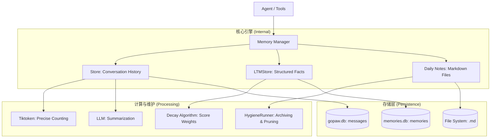

# GoPaw Memory 模块设计文档

## 职责

Memory 模块是 GoPaw 的核心记忆中枢，负责管理 Agent 的全生命周期记忆。它采用受生物启发的“三层记忆模型”，确保 Agent 既能维持连贯的对话，又能持久记住关键事实，并能自动“遗忘”无关噪音。

### 三层记忆模型

1.  **短期会话记忆 (Conversational Memory)**：
    *   **存储**：SQLite `messages` 表（`store.go`）。
    *   **特性**：基于 `SessionID` 隔离，支持精确的 Tiktoken 计数和 LLM 驱动的自动压缩（Summary）。
    *   **用途**：提供对话的直接上下文。
2.  **长期结构化记忆 (LTM - Long Term Memory)**：
    *   **存储**：SQLite `memories` 表（`ltm_store.go`）。
    *   **特性**：支持 `Core` (永久), `Daily` (日常), `Conversation` (片段) 分类。
    *   **算法**：FTS5 全文搜索 + BM25 评分 + **指数级时间衰减 (Time Decay)**。
    *   **用途**：存储用户偏好、重要事实和跨会话知识。
3.  **临时笔记记忆 (Daily Notes)**：
    *   **存储**：本地文件系统 `.md` 文件（`memory_note.go`）。
    *   **特性**：按日期组织，支持快速追加观察结果。
    *   **用途**：记录当天的琐碎观察，30 天后自动归档。

---

## 架构图

---

## 核心算法与逻辑

### 1. 精确 Token 计数 (`tokenizer.go`)
*   使用 `cl100k_base` 编码（兼容 GPT-4/Claude）。
*   **Fallback 机制**：若 Tiktoken 初始化失败，自动降级为 `runes / 4` 的近似估算。

### 2. 指数级时间衰减与核心增强 (`ltm_store.go`)
*   **衰减公式**：`Score = Score * 2^(-age_days / half_life)`。
*   **Core Category Boost**：`CategoryCore` 类型的记忆免除衰减，并获得 `+0.3` 的相关性偏好加成。
*   **混合检索**：通过 FTS5 的 BM25 原始分数与时间权重结合，确保 Agent 既能找到相关的，又能找到“新鲜”的记忆。

### 3. 异步压缩机制 (`manager.go`)
*   **MaybeCompress**：在每一轮对话前非阻塞检查。
*   **双速压缩**：
    *   超过阈值：启动异步 LLM 摘要任务。
    *   超过 2 倍阈值：立即执行“强制裁剪”（紧急降级），确保系统不崩溃。

### 4. 记忆卫生维护 (`hygiene.go`)
*   **HygieneRunner**：后台协程，定期执行：
    *   将旧的 Daily Notes 合并为月度归档。
    *   从数据库中物理删除过期的会话片段记忆。

---

## 关键代码映射

| 功能 | 对应文件 | 关键类/函数 |
| :--- | :--- | :--- |
| 对话管理 | `manager.go` | `Manager`, `Add()`, `GetContext()` |
| 事实存储 | `ltm_store.go` | `LTMStore`, `Recall()`, `ApplyTimeDecay()` |
| 自动摘要 | `compress.go` | `Compressor.Summarise()` |
| Token 计算 | `tokenizer.go` | `CountTokens()` |
| 每日笔记 | `tools/memory_note.go` | `MemoryNoteTool.Execute()` |
| 搜索工具 | `tools/memory_recall.go` | `MemoryRecallTool.Execute()` |

---

## 依赖关系

*   `github.com/pkoukk/tiktoken-go`：用于精确 Token 计算。
*   `modernc.org/sqlite`：纯 Go 实现的 SQLite 驱动。
*   `go.uber.org/zap`：结构化日志审计。
