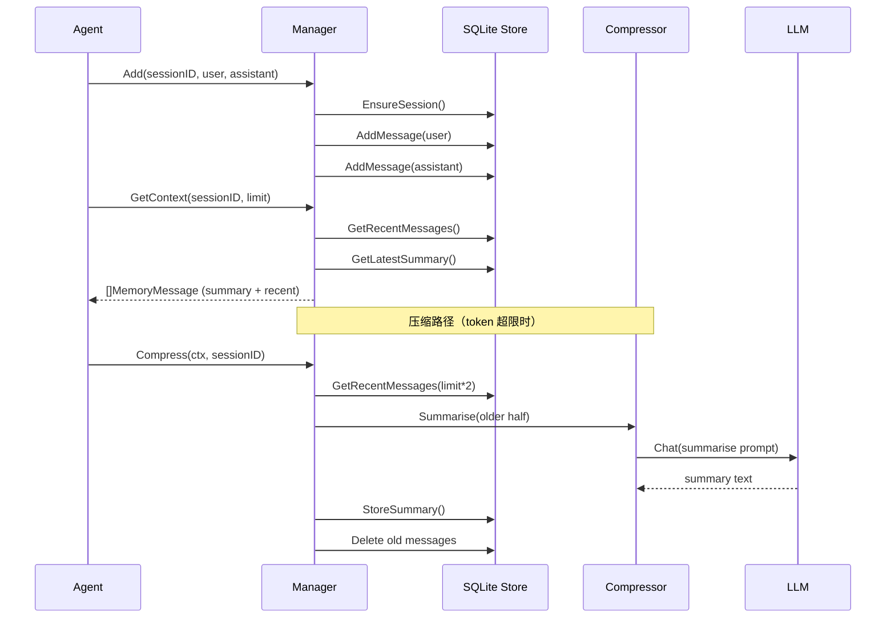

# Memory 模块设计文档

## 职责

Memory 模块管理 Agent 的对话记忆，分为两层：

- **短期记忆**：内存中的滑动窗口，最近 N 条消息，每次调用 LLM 时作为 context 传入
- **长期记忆**：SQLite 持久化，支持 FTS5 全文搜索，重启后可恢复

具体职责：
- 持久化每轮用户↔助理对话
- 根据 session_id 隔离不同用户/频道的上下文
- 当 token 数超过阈值时自动调用 LLM 压缩旧消息为摘要
- 提供 FTS5 全文搜索（长期记忆检索）

Memory 模块**不负责**：
- Token 精确计数（使用字符近似估算）
- 向量检索

## 架构图



## 核心接口

```go
type Manager struct { ... }

func (m *Manager) Add(sessionID, userID, channel, userMsg, assistantMsg string) error
func (m *Manager) GetContext(sessionID string, limit int) ([]MemoryMessage, error)
func (m *Manager) Search(sessionID, query string, limit int) ([]MemorySnippet, error)
func (m *Manager) Compress(ctx context.Context, sessionID string) error
func (m *Manager) Clear(sessionID string) error
```

## 关键设计决策

1. **SQLite WAL 模式**：启用 WAL 日志提升并发读写性能，适合单服务器多会话场景。
2. **FTS5 触发器**：FTS 索引与 messages 表同步更新，在同一事务内完成，保证一致性。
3. **压缩取最旧 50%**：保留最近一半消息原文，压缩更旧的内容，确保 Agent 总能看到最近上下文。
4. **摘要前缀注入**：压缩后摘要以 `[历史摘要]` 前缀作为 system 消息注入 context，LLM 感知历史存在但不占用太多 token。

## 依赖关系

- **依赖**：`modernc.org/sqlite`（纯 Go SQLite 驱动）、`internal/llm`（压缩调用）、`github.com/google/uuid`
- **被依赖**：`internal/agent`（读写记忆）

## 验收标准

- [ ] Add() 写入后 GetContext() 能正确返回该轮对话
- [ ] 重启后能从 SQLite 恢复历史消息
- [ ] FTS5 搜索能按关键词检索历史对话
- [ ] Compress() 执行后旧消息被替换为摘要，且 GetContext() 包含摘要前缀
- [ ] Clear() 删除 session 的全部数据

## 配置项

```yaml
agent:
  memory:
    context_limit: 4000   # token 数超过此值触发压缩
    history_limit: 50     # 最多保留最近 50 条消息
```
