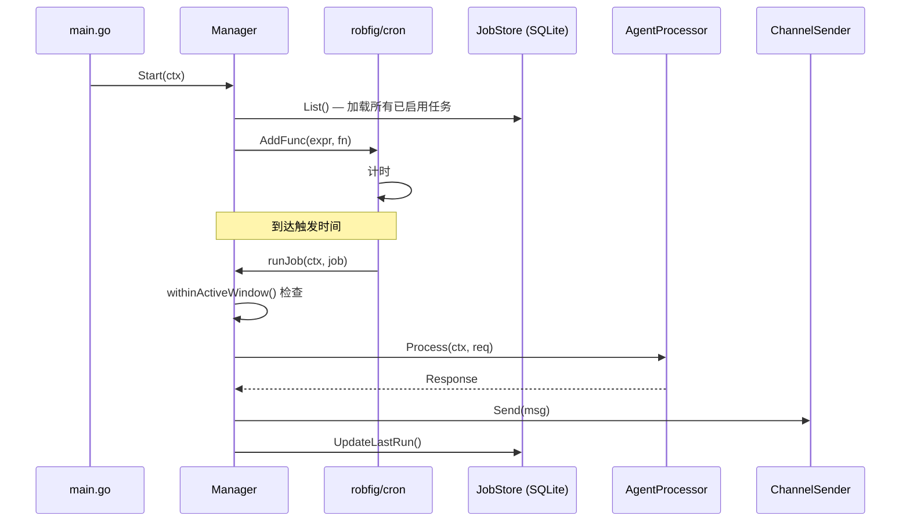

# Scheduler 模块设计文档

## 职责

Scheduler 模块管理 GoPaw 的定时任务（Heartbeat），允许在指定时间自动触发 Agent 执行预设指令：
- 基于 robfig/cron 实现标准 Cron 表达式调度
- 支持活跃时间窗口（active_from / active_until）过滤执行
- 任务定义持久化到 SQLite（cron_jobs 表）
- 任务执行后记录 last_run / next_run

Scheduler 模块**不负责**：
- Agent 本身的逻辑处理（通过 AgentProcessor 回调委托）
- 消息发送（通过 ChannelSender 回调委托）

## 架构图



## 核心接口

```go
type Manager struct { ... }

func NewManager(store *JobStore, process AgentProcessor, send ChannelSender, logger *zap.Logger) *Manager
func (m *Manager) Start(ctx context.Context) error
func (m *Manager) Stop()
func (m *Manager) AddJob(ctx context.Context, job *CronJob) (string, error)
func (m *Manager) RemoveJob(id string) error
func (m *Manager) TriggerJob(ctx context.Context, id string) error
func (m *Manager) ListJobs() ([]CronJob, error)
```

## 关键设计决策

1. **依赖注入回调**：Process 和 Send 以函数类型注入，避免循环依赖（scheduler → agent → scheduler）。
2. **活跃窗口字符串比较**：active_from / active_until 使用 "HH:MM" 字符串比较，无需解析时区，简单可靠。
3. **WithSeconds()**：使用带秒精度的 Cron，为未来需要精细调度的场景预留空间。

## 依赖关系

- **依赖**：`github.com/robfig/cron/v3`、`modernc.org/sqlite`（通过 JobStore）、`pkg/types`
- **被依赖**：`cmd/gopaw`（注入 Start/Stop）、`internal/server/handlers/cron.go`（CRUD API）

## 验收标准

- [ ] 启动时加载并调度 SQLite 中所有 enabled=1 的任务
- [ ] Cron 表达式错误时返回清晰错误，不影响其他任务
- [ ] active_from/active_until 限制在窗口外不执行
- [ ] TriggerJob 能立即触发一次执行
- [ ] AddJob / RemoveJob 持久化到 SQLite 且立即生效

## 配置项

调度任务通过 API 或 Web Console 管理，无需在 config.yaml 中配置。
