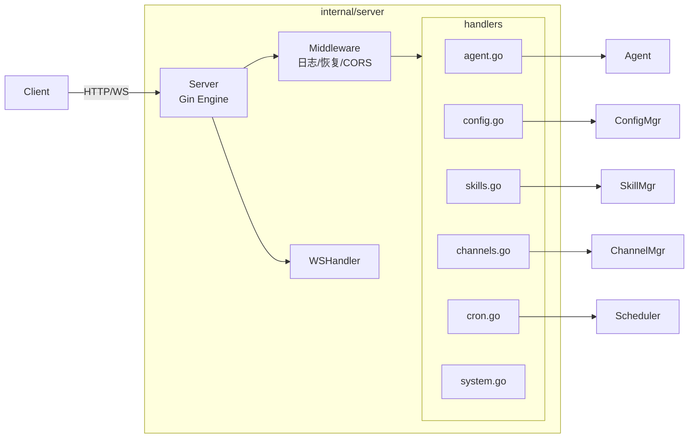

# Server 模块设计文档

## 职责

Server 模块负责：
- 基于 Gin 框架提供 REST API 和 WebSocket 端点
- 注册所有路由并注入依赖（handler 实例）
- 提供中间件（结构化日志、Panic 恢复、CORS）
- 实现 SSE（Server-Sent Events）流式响应
- 实现 WebSocket 双向通信

Server 模块**不负责**：
- 业务逻辑（由各 handler 调用对应领域模块完成）
- 静态文件服务（v0.1 通过 embed 延后实现）

## 架构图



## 核心接口

```go
type Server struct { ... }

func New(cfg, agent, channelMgr, skillMgr, scheduler, cfgMgr, logger) *Server
func (s *Server) Start() error
func (s *Server) Shutdown(ctx context.Context) error
```

## 关键设计决策

1. **依赖注入**：所有 handler 通过构造函数接收依赖，方便测试（可 mock）。
2. **SSE 流式**：ChatStream 端点使用 Transfer-Encoding: chunked + text/event-stream，通过 `X-Accel-Buffering: no` 禁用 Nginx 缓冲。
3. **WebSocket 单读循环**：每个连接一个 goroutine，消息到来时同步处理，防止乱序响应。
4. **ReadTimeout/WriteTimeout**：设置合理超时防止慢客户端挂住服务器资源。

## 依赖关系

- **依赖**：`github.com/gin-gonic/gin`、`github.com/gorilla/websocket`、所有内部模块（通过 handler 注入）
- **被依赖**：`cmd/gopaw`（Start/Shutdown 调用）

## 验收标准

- [ ] GET /health 返回 200 {"status":"ok"}
- [ ] POST /api/agent/chat 能收到 agent 响应
- [ ] GET /api/agent/chat/stream 返回 SSE 格式数据流
- [ ] WS /ws 建立连接后能收发消息
- [ ] panic 被中间件捕获，返回 500 而非进程崩溃
- [ ] 所有请求被 ZapLogger 记录（method、path、status、latency）
