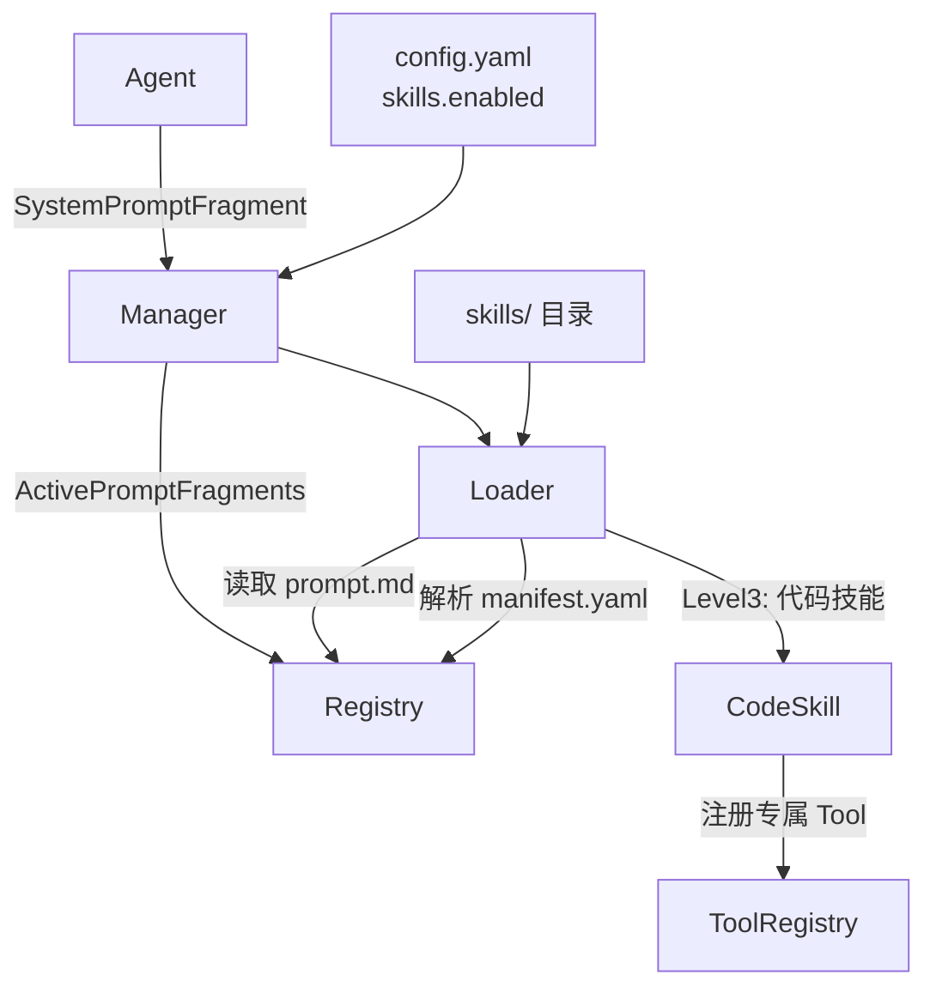

# Skill 模块设计文档

## 职责

Skill 模块实现 GoPaw 的三层技能体系（Level 1/2/3），负责：
- 扫描 `skills/` 目录，发现并解析技能清单（manifest.yaml）
- 读取 prompt.md 内容，在 Agent 构建系统提示时注入相关片段
- 维护技能注册表（启用/禁用、查询）
- Level-3 代码技能初始化后自动注册其携带的 Tool

Skill 模块**不负责**：
- Level-2 工作流 YAML 的完整执行引擎（v0.2 实现）
- 技能代码的下载和热更新（v0.4 实现）

## 架构图



## 核心接口

```go
// Registry
func (r *Registry) Register(e *Entry) error
func (r *Registry) Get(name string) (*Entry, error)
func (r *Registry) All() []*Entry
func (r *Registry) ActivePromptFragments() string
func (r *Registry) SetEnabled(name string, enabled bool) error

// Manager
func (m *Manager) Load(enabledList []string) error
func (m *Manager) SystemPromptFragment() string
func (m *Manager) Registry() *Registry
```

## 关键设计决策

1. **目录即技能**：每个子目录 = 一个技能，manifest.yaml 是必需的入口文件，其他文件按需解析。
2. **编译内置 Level-3**：Level-3 技能的 Go 代码必须编译进二进制（通过 init() 注册），文件系统中仅保留 manifest 和 prompt，运行时动态加载不是目标（避免 Go plugin 的兼容问题）。
3. **enabledList 为空 = 全部启用**：简化配置，用户不填 `skills.enabled` 时自动启用所有已安装技能。

## 依赖关系

- **依赖**：`pkg/plugin`（Skill/SkillManifest 接口）、`internal/tool`（Level-3 工具注册）、`gopkg.in/yaml.v3`
- **被依赖**：`internal/agent`（SystemPromptFragment）、`internal/server/handlers`（skills API）

## 验收标准

- [ ] `skills/example/` 目录中的技能能被正确加载
- [ ] 只有 `skills.enabled` 列表中的技能的 prompt 被注入
- [ ] Level-3 技能的 Tools() 方法返回的工具自动注册到 ToolRegistry
- [ ] `skills/` 目录不存在时优雅跳过，不返回错误

## 配置项

```yaml
skills:
  dir: skills/
  enabled:
    - news
    - pdf
```
