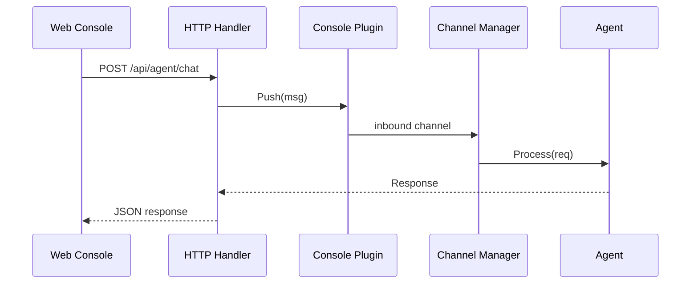

# Console Channel 设计文档

## 职责

Console 频道是内置的 Web Console 接入层：
- 提供一个带缓冲的 inbound channel，供 HTTP/WebSocket 层注入消息
- 随核心进程启动，无需额外配置
- 作为开发调试的默认频道

## 架构图



## 核心接口

Console Plugin 实现了标准 `plugin.ChannelPlugin` 接口，额外提供：

```go
func (p *Plugin) Push(msg *types.Message)  // HTTP 层主动注入消息
```

## 关键设计决策

Console 频道不通过正常的 Receive() → Agent 路径处理消息（HTTP handler 直接调用 agent.Process），Push() 方法保留用于未来的 WebSocket 连接管理。

## 依赖关系

- **依赖**：`internal/channel`（注册表）、`pkg/types`
- **被依赖**：`internal/server/handlers/agent.go`（消息注入）

## 验收标准

- [ ] 启动时自动注册，无需配置
- [ ] Health() 始终返回 Running=true
