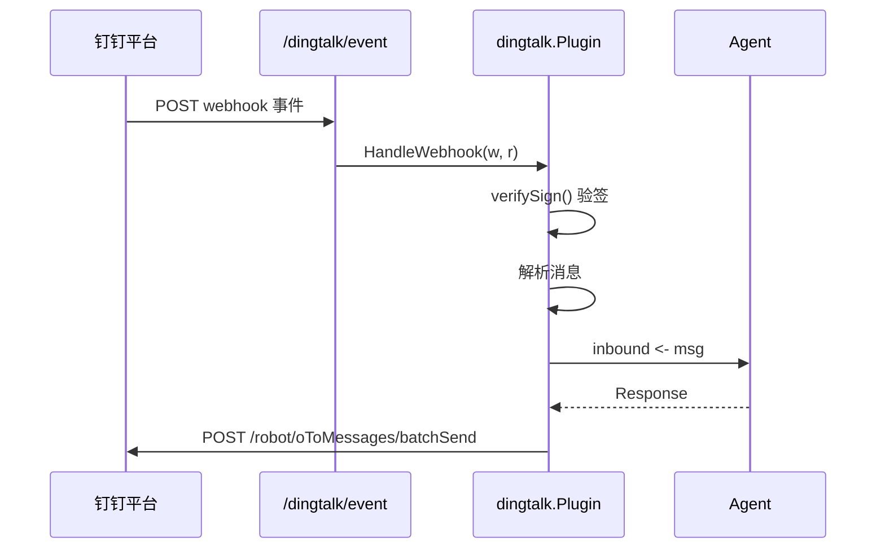

# 钉钉频道插件设计文档

## 职责

钉钉频道插件负责：
- 通过 OAuth2 Client Credentials 流程获取 access_token
- 接收钉钉 Webhook 事件回调（企业内部机器人）
- 验证请求签名（HMAC-SHA256）
- 发送消息到钉钉用户（batchSend API）

## 架构图



## 关键设计决策

1. **标准库 HTTP 实现**：不依赖钉钉官方 SDK，减少第三方依赖。
2. **HMAC-SHA256 验签**：防止伪造请求，使用 timestamp + client_secret 构造签名串。

## 依赖关系

- **依赖**：`internal/channel`（注册表）、`pkg/types`
- **被依赖**：`internal/server`（注册 Webhook 路由）

## 验收标准

- [ ] client_id/client_secret 缺失时 Init() 返回错误
- [ ] 签名验证失败时返回 401
- [ ] 收到文本消息后通过 inbound channel 传递
- [ ] Send() 成功发送消息到指定用户

## 配置项

```yaml
plugin:
  dingtalk:
    client_id: ${DINGTALK_CLIENT_ID}
    client_secret: ${DINGTALK_CLIENT_SECRET}
```
