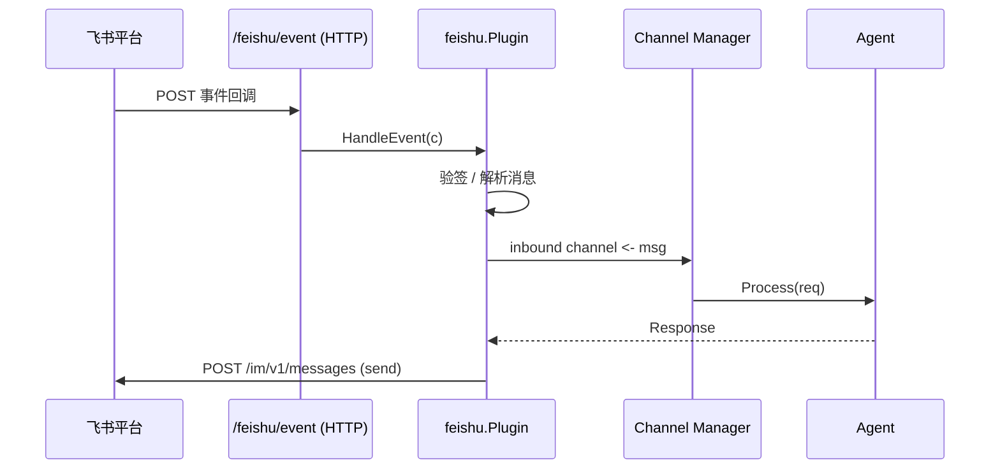

# 飞书频道插件设计文档

## 职责

飞书频道插件负责：
- 接收飞书开放平台的事件回调（im.message.receive_v1）
- 验证回调合法性（verification_token 验签）
- 处理 URL 验证 Challenge 响应（飞书事件订阅激活时需要）
- 获取并管理 app_access_token（应用级 Token）
- 发送消息回飞书聊天（text 格式）

## 架构图



## 核心接口

实现标准 `plugin.ChannelPlugin` 接口，额外提供：
```go
func (p *Plugin) HandleEvent(c *gin.Context)  // Gin handler for POST /feishu/event
```

## 关键设计决策

1. **不使用飞书官方 SDK**：使用标准 `net/http` 实现，减少依赖，避免版本冲突。
2. **app_access_token 刷新**：Token 有效期约 2 小时，v0.1 在 Start() 时获取一次，v0.2 引入定期刷新。
3. **receive_id_type=chat_id**：统一使用 chat_id 发送，SessionID 即 chat_id。

## 依赖关系

- **依赖**：`internal/channel`（注册表）、`pkg/types`、`github.com/gin-gonic/gin`
- **被依赖**：`internal/server`（注册 Webhook 路由）

## 验收标准

- [ ] 飞书 URL 验证 Challenge 正确响应
- [ ] 接收到文本消息后能通过 Receive() channel 返回
- [ ] Send() 能将消息发送到对应 chat_id
- [ ] app_id/app_secret 缺失时 Init() 返回明确错误

## 配置项

```yaml
plugin:
  feishu:
    app_id: ${FEISHU_APP_ID}
    app_secret: ${FEISHU_APP_SECRET}
    verification_token: ${FEISHU_VERIFICATION_TOKEN}
    encrypt_key: ${FEISHU_ENCRYPT_KEY}
```
